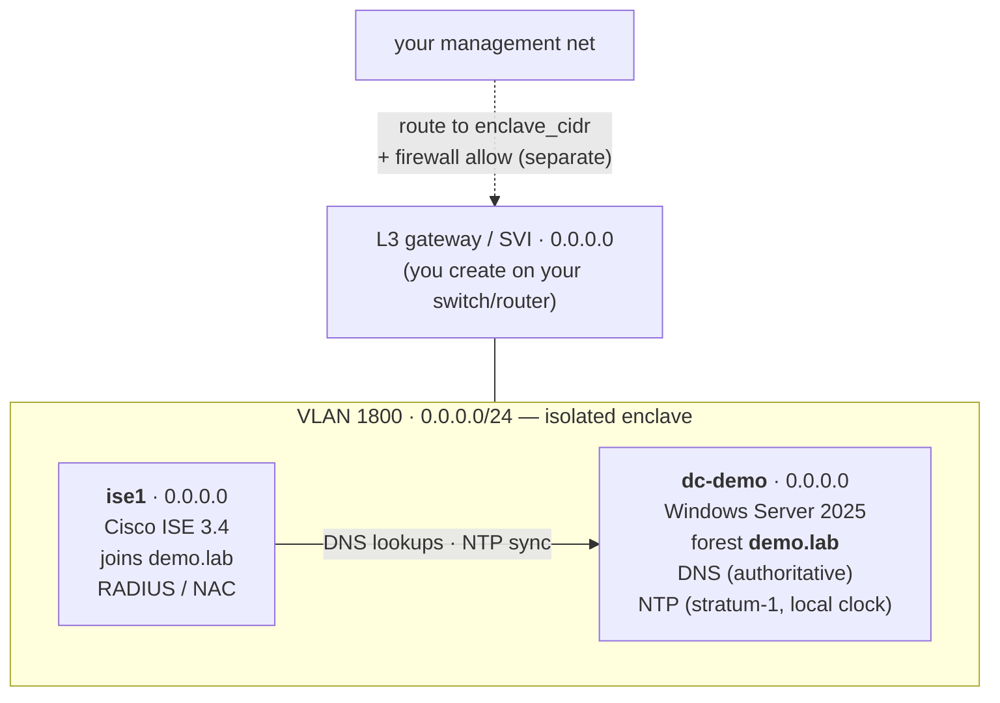

# Architecture

## The enclave

Everything lives on **one isolated VLAN** (`enclave_vlan`, default **1800** → `0.0.0.0/24`).
Routing to production is intentionally **not** required — the two VMs talk to each other on the
shared subnet, and the only external dependency is an L3 gateway you create for the VLAN.

## DNS + NTP flow

The DC is the **single source of truth** for both:

- **DNS** — `demo.lab` is an AD-integrated forest; ISE points its nameserver at `0.0.0.0` during
  setup, which is exactly why the **DC is built first**.
- **NTP** — a freshly-promoted DC is *unsynchronized* and ISE refuses it, so the DC is made an
  **authoritative stratum-1 server off its own clock**. The full story (and the `w32tm` trap) is in
  [Gotchas → Windows DC NTP](GOTCHAS.md#windows-dc-ntp-this-one-is-nasty).

## Reaching the ISE admin GUI from another VLAN

The enclave is isolated by design. To reach ISE's admin GUI from a management network, your L3
device must **route to `enclave_cidr`** and your firewall must permit it — deliberately **outside**
this build. Within the enclave, ISE ↔ DC works with no routing.
