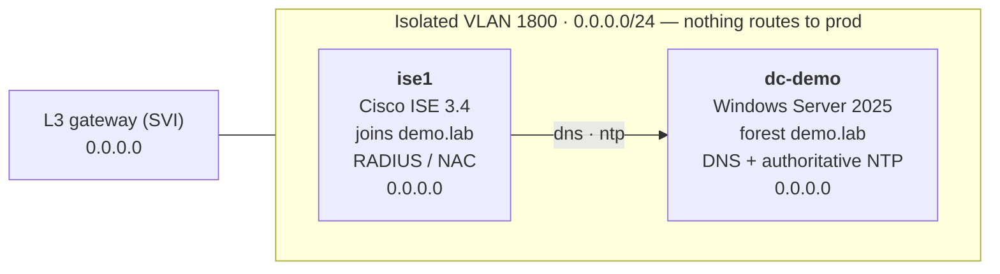

# ISE Demo Enclave

**Ansible that stands up a self-contained Cisco ISE 3.4 + Windows Server 2025 Active Directory
lab on Proxmox — end to end.** A Windows Server 2025 Domain Controller (new isolated forest,
DNS + authoritative NTP, installed fully unattended) and a Cisco ISE 3.4 node that joins it,
both on one isolated VLAN, provisioned by **one reusable role** (`proxmox_vm`) — the only
difference between the two builds is a per-host `vm_spec`.

[Quick Start](quick-start.md){ .md-button .md-button--primary }
[View on GitHub](https://github.com/labaccessnow/ise-demo-enclave){ .md-button }

## What it builds

## Why this exists

Doing this by hand hides a pile of sharp edges: unattended Windows answer files, the ISE
installer's reboot-into-reinstall trap, Windows NTP refusing to serve, and driving the ISE
serial setup wizard. Every one of them is encoded here and written down in
**[Gotchas](GOTCHAS.md)**.

!!! warning "Lab tool"
    It wipes/creates VMs and writes AD + NTP config. Run it against a **lab** Proxmox node, not
    production. No warranty.

## Where to go next

- **[Quick Start](quick-start.md)** — requirements + the two-command run.
- **[Configuration](configuration.md)** — the knobs in `group_vars` / `host_vars`.
- **[How the Role Works](how-the-role-works.md)** — one role, two VMs, only `vm_spec` differs.
- **[Gotchas](GOTCHAS.md)** — the sharp edges, each one written down.
- **[Architecture](architecture.md)** — the enclave network + DNS/NTP flow.
